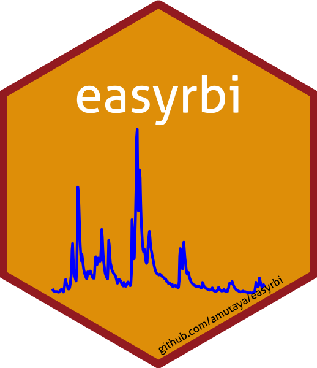

```{r, include = FALSE}
knitr::opts_chunk$set(
  collapse = TRUE,
  comment = "#>",
  fig.path = "man/figures/README-",
  out.width = "100%"
)
```


### easyrbi R Package 

<!-- badges: start -->
[](https://lifecycle.r-lib.org/articles/stages.html#experimental)
[](https://CRAN.R-project.org/package=SDS270)
[](https://github.com/wndlovu/easyrbi/actions)
<!-- badges: end -->


## Overview

The [`easyrbi`](https://github.com/amutaya/easyrbi) R package consists of functions that retrieve streamflow data (pCode = 00060) from the [USGS website](https://waterservices.usgs.gov/rest/Site-Test-Tool.html), by using tools in the `dataRetrieval` package. Another set of functions can be used to calculate the Richards-Baker Flashiness Index (RBI) trends over time for any given gauge stations. The package also contains functions to download time series land use data [USGS Gages II](https://www.sciencebase.gov/catalog/item/59692a64e4b0d1f9f05fbd39) collected between 1931-01-01 and 2014-12-31. Some of the functions included in the package:

- `sitedata`: retrieves hydrology data for given USGS gauge sites for a specified period.
- `rbi_df`: returns calculated RBI values for given USGS sites for a specified period.
- `trends`: returns a data frame containing Mann-Kendall and sens.slope summary statistics for a custom number of sites specified by the user.
- `basin_id`: Check the drainage area, eco-region and classification (reference or non-reference)
- `dam_removal`: retrieves dam removal data from the USGS Gages II website for any number of given gauge station numbers.


## Installation

You can install the development version of easyrbi from Github:
```{r, eval=FALSE, message=FALSE}
# If you haven't installed remotes yet, do so:
# install.packages("remotes")
remotes::install_github("amutaya/easyrbi")
```

## Examples

```{r example, message=FALSE}
library(easyrbi)
library(tidyverse)
library(trend)
library(Kendall)
library(dataRetrieval)
library(usethis)
```

### Retrieve USGS gauge station data 

#### Site data
- Returns a data.frames with 18 variables from the USGS database which include discharge, drainage area and the waterYear.
```{r, eval = TRUE}
sitedata(c("01564500", "01567000"), "1970-10-01", "1980-09-30") %>% 
  head(10)
```

#### Calculate the annul Richards Barker Flashiness Index (RBI) 
- Returns a data.frames with the waterYear and respective RBI values for given sites over a specified timeframe
```{r, eval = TRUE}
rbi_df(c("01564500", "01567000"), "1970-10-01", "1980-09-30")
```
#### Test time series trends
- To test the falshiness trends over time, `trends` returns the Mann-Kendall and sens.slope summary statistics for any given USGS gauge sites. 
```{r, eval=TRUE}
data <- rbi_df(c("01564500", "01567000"), "1970-10-01", "1980-09-30")

trends(x = data) 
```
### Basin classification and data

#### Basin ID
- Retrieve site classification (Reference and Non-reference sites) and watershed area from USGS GAGES II.
```{r, eval=TRUE, warning=FALSE, message=FALSE}
basin_id(c("01567000", "01490000", "01492500"))
```
### Retrieve land use data

#### Dam removals
- Retrieves dam removal data for specified sites directly from the USGS Gages II website. This time series data recorded between 1931-01-01 and 2014-12-31.
```{r, eval=TRUE, warning=FALSE, message=FALSE}
dam_removal(c("01564500", "01567000"))
```


